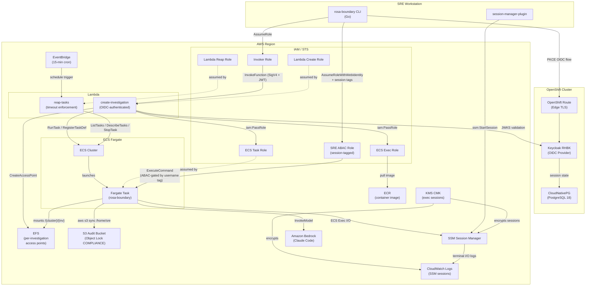

# rosa-boundary Security Assessment

> **Jira:** [ROSAENG-304](https://redhat.atlassian.net/browse/ROSAENG-304) — Security Audit  
> **Parent:** ROSA-738 — Implement ROSA Boundary  
> **Audit Date:** 2026-05-18  
> **Commit:** 6e079f7  
> **Standard:** AWS Well-Architected Framework (Security Pillar), FedRAMP High, CIS AWS Foundations Benchmark  
> **Platform Goal:** Zero Operator Access (ZOA) — SREs interact with customer clusters exclusively through a controlled, audited ephemeral container. No persistent access, no unaudited paths.

---

## Component Dependency Graph



---

## Section 1: ZOA Assessment Summary

| # | Audit Area | Verdict | Blocking Findings |
|---|-----------|---------|-------------------|
| 1 | Authentication Chain | **CONDITIONAL PASS** | M15 (no jti replay tracking) |
| 2 | Authorization & ABAC Model | **FAIL** | H3 (cross-user task enumeration), H5 (timeout=0 bypass) |
| 3 | Container Security | **FAIL** | H4 (root sudo enables audit sync bypass via SIGKILL) |
| 4 | Lambda Security | **CONDITIONAL PASS** | H5 (task_timeout=0 accepted), M12 (EFS cleanup fails silently) |
| 5 | Infrastructure Configuration | **FAIL** | H1 (no CloudTrail), H2 (Lambda outside VPC) |
| 6 | Data Handling & Audit Integrity | **FAIL** | H4 (audit sync bypassable), M3 (SSM logs unencrypted), M4 (SSE-S3 not KMS) |
| 7 | Tamper Resistance | **CONDITIONAL PASS** | H4 (SIGKILL bypass via sudo ALL), H5 (timeout disabled via task_timeout=0) |

**Overall ZOA Productization Gate: FAIL.**

Five high-severity findings directly violate ZOA guarantees. All must be remediated before productization.

---

## Section 2: Implementation Strategy

### Recommended Remediation Approach

Findings fall into four implementation waves based on **ZOA impact**, **effort**, and **dependency ordering**. Address waves sequentially — later waves depend on infrastructure that earlier waves establish.

```
Wave 1 (1–2 days) — ZOA blockers, single-file changes
Wave 2 (1–2 weeks) — FedRAMP controls, moderate Terraform changes  
Wave 3 (1–2 weeks) — Architectural, requires VPC/networking coordination
Wave 4 (ongoing) — Supply chain hygiene, CI/CD changes
```

### Wave 1 — ZOA Blockers, Low Effort

These are single-file or two-file changes. No infrastructure coordination required. Fix these first — they close the most critical ZOA property violations.

| Finding | Change | Files |
|---------|--------|-------|
| H4 | Remove `sudo ALL` from container | `Containerfile` |
| H5 (part 1) | Remove `task_timeout` from client request body | `lambda/create-investigation/handler.py` |
| H5 (part 2) | Remove deadline tag IAM gate from reaper | `deploy/regional/lambda-reap-tasks.tf` |
| M12 | Add `DeleteAccessPoint` IAM + fix silent `except` | `lambda-create-investigation.tf`, `handler.py` |
| M13 | Remove `s3:PutObjectAcl` from task role | `deploy/regional/iam.tf` |
| M16 | KMS deletion window 7 → 30 days | `deploy/regional/kms.tf` |
| L4 | Validate `oc_version` against allowlist | `lambda/create-investigation/handler.py` |
| L11 | Add max cap to `task_timeout` | `handler.py`, `lambda-create-investigation.tf` |

### Wave 2 — FedRAMP Controls, Medium Effort

These require new Terraform resources or IAM restructuring. They can proceed in parallel within the wave.

| Finding | Change | Files |
|---------|--------|-------|
| H1 | Add CloudTrail + GuardDuty | `deploy/regional/main.tf` |
| H3 | Split `DescribeAndListECS` with ABAC conditions | `deploy/regional/oidc.tf` |
| M2 | Scope KMS Decrypt to exec session key | `deploy/regional/oidc.tf` |
| M3 | Enable CloudWatch log encryption for SSM sessions | `deploy/regional/ecs.tf` |
| M4 | Switch S3 audit bucket to SSE-KMS | `deploy/regional/s3.tf`, `kms.tf` |
| M5 | Add EFS filesystem policy | `deploy/regional/efs.tf` |
| M6 | Add TLS-enforcing S3 bucket policy | `deploy/regional/s3.tf` |
| M7 | Remove wildcard CORS from Lambda function URL | `lambda-create-investigation.tf`, `handler.py` |
| M10 | Scope Bedrock IAM to `us-east-1` and specific models | `deploy/regional/iam.tf` |
| M11 | Add `aws:SourceAccount` confused deputy conditions | `deploy/regional/iam.tf` |
| M15 | Implement DynamoDB-backed jti replay tracking | `handler.py`, `lambda-create-investigation.tf` |
| L2 | Remove EFS security group egress rule | `deploy/regional/efs.tf` |
| L5 | Commit Terraform lock file | `deploy/regional/.gitignore` |
| L10 | Set log retention and S3 Object Lock to 365 days | `deploy/regional/variables.tf` |

### Wave 3 — Architectural Changes

These require VPC endpoint provisioning and Lambda redeployment. Coordinate with networking team.

| Finding | Change | Files |
|---------|--------|-------|
| H2 | Deploy Lambda inside VPC with interface endpoints | `lambda-create-investigation.tf`, `lambda-reap-tasks.tf`, new `vpc-endpoints.tf` |
| M1 | Scope Lambda ECS IAM to cluster and task-def ARNs | `deploy/regional/lambda-create-investigation.tf` |
| M14 | EFS CMK encryption | `deploy/regional/efs.tf`, `kms.tf` |

### Wave 4 — Supply Chain Hygiene (Ongoing)

Address these during the next container/CI build cycle. Add to PR checklist.

| Finding | Change | Files |
|---------|--------|-------|
| M8 | Scope sudo to `/usr/sbin/alternatives` only (H4 fix covers this) | `Containerfile` |
| M9 | Pin Python deps to exact versions; add `uv lock --check` in CI | `pyproject.toml`, CI workflow |
| L3 | Fix example script to use `assignPublicIp=DISABLED` | `deploy/regional/examples/launch_task.sh` |
| L6 | Digest-pin Fedora base image | `Containerfile` |
| L7 | Verify Claude Code installer checksum | `Containerfile` |
| L8 | Pin GitHub Actions to commit SHAs | `.github/workflows/*.yml` |
| L9 | Replace `curl \| sh` uv install with `astral-sh/setup-uv` action | `.github/workflows/localstack-tests.yml` |

---

## Section 3: Detailed Findings per Audit Area

### Area 1: Authentication Chain

**PKCE Flow (`internal/auth/oidc.go`):** Correct. Code verifier is 32 bytes of `crypto/rand`, hashed with SHA-256 for the S256 challenge. State parameter uses 16 bytes of `crypto/rand`. State is validated against `expectedState` at `callback.go:73` before the authorization code is accepted. The callback server binds to `127.0.0.1:8400` only — no network-accessible CSRF vector.

**Token Storage (`internal/auth/token.go`):** The cached token file is written with `0o600` permissions. Cache validity is 4 minutes, deliberately short to limit replay windows. The token `exp` (set by Keycloak, typically 5 minutes) is the actual replay window.

**Lambda OIDC Validation (`lambda/create-investigation/handler.py`):** The `validate_oidc_token()` function correctly:

- Routes to the correct issuer JWKS by matching the unverified `iss` claim against configured issuers (not the user-controlled value)
- Validates only against known, configured issuers — unknown `iss` values return `None`
- Verifies RS256 signature, `exp`, and `aud` via `PyJWKClient`
- Cross-issuer token substitution is blocked: the JWKS URL is built from the *configured* issuer URL, not the token's `iss`

**Multi-Issuer Routing:** Three issuers (primary, stage, prod) each use their own JWKS and `client_id`. A stage token cannot be accepted by the prod validation path because `iss` must match exactly and `aud` must match the prod `client_id`. Cross-issuer substitution is blocked.

**Finding M15 — No jti Replay Tracking:** PyJWT's `decode()` does not validate `jti` and there is no server-side token store. A stolen ID token (from `~/.cache/rosa-boundary/token-cache`, `0o600` but accessible to the local user) can be replayed within its `exp` window to create additional investigations under the victim's identity.

---

### Area 2: Authorization & ABAC Model

**Session Tag Propagation:** The ABAC model relies on the `https://aws.amazon.com/tags` JWT claim containing `principal_tags: {username: ["alice"]}`. AWS STS automatically processes this claim during `AssumeRoleWithWebIdentity`. SREs cannot inject false session tags because the JWT content is controlled by Keycloak, and the role trust policy allows only `AssumeRoleWithWebIdentity` — not `AssumeRole` with manual `TagSession`.

**Trust Policy (`deploy/regional/oidc.tf`):** Correctly conditions on `${local.oidc_provider_domain}:aud` matching `var.oidc_client_id`. The `sts:TagSession` action is included — required for session tag propagation.

**Cross-User Exec Prevention:** Verified sound. `ExecuteCommandOnOwnedTasks` uses `StringEquals: {"ecs:ResourceTag/username": "${aws:PrincipalTag/username}"}`. If `aws:PrincipalTag/username` is empty, the condition evaluates to `false` — fail-closed. User A cannot exec into User B's task.

**Finding H3 — Cross-User Task Enumeration:** The `DescribeAndListECS` IAM statement grants `ecs:DescribeTasks`, `ecs:ListTasks`, `ecs:DescribeTaskDefinition` on `Resource = "*"` with **no conditions**. Any authenticated SRE can enumerate all running tasks and their tags — including `oidc_sub`, `cluster_id`, `investigation_id`, `username`, and `deadline` for every other active investigation. Task definitions also expose environment variables: `CLUSTER_ID`, `INVESTIGATION_ID`, `OC_VERSION`, `S3_AUDIT_BUCKET`. This is an information disclosure breach of the isolation model.

**Finding H5 — task_timeout=0 Disables Reaper (ZOA violation):** The `task_timeout` parameter is accepted from the client request body at `handler.py:133`, allowing any authenticated SRE to pass `task_timeout=0`. This removes the `deadline` tag entirely. The reaper IAM `ecs:StopTask` is itself conditioned on the presence of a `deadline` tag — tasks without one cannot be stopped by the reaper even if manually invoked. The combination creates permanently unmanaged sessions with no timeout enforcement.

---

### Area 3: Container Security

**SRE User:** UID/GID 1000, created by `useradd`. No capabilities explicitly granted. No `securityContext` escalation in the task definition. No credentials baked into the image.

**Entrypoint Injection Analysis (`entrypoint.sh`):** No injection risks found:
- `OC_VERSION` is path-validated before use (`if [ -x "/opt/openshift/${OC_VERSION}/oc" ]`)
- `AWS_CLI` goes through a `case` statement with explicit pattern matching
- S3 path components are validated in the Lambda handler by `validate_identifier()` enforcing `[a-zA-Z0-9_-]`
- The `KUBE_PROXY_PORT` variable goes into a heredoc file — not shell-executed

**Finding H4 — Root Sudo Enables SIGKILL Audit Sync Bypass (ZOA violation):** `Containerfile:66` writes `sre ALL=(ALL) NOPASSWD: ALL` to `/etc/sudoers.d/sre`. This grants the SRE root access inside the container. The entrypoint traps SIGTERM/SIGINT/SIGHUP (`entrypoint.sh:46`) but **SIGKILL cannot be trapped**. With `sudo kill -9 1`, the SRE can send SIGKILL to PID 1, bypassing all signal handlers and the S3 audit sync entirely. This is the highest-impact ZOA property violation in the codebase.

**Skeleton Claude Config (`skel/sre/.claude/settings.json`):** Contains only `{"env": {"CLAUDE_CODE_USE_BEDROCK": "1", "DISABLE_AUTOUPDATER": "1"}}`. No credentials or sensitive data.

**Supply Chain (L6, L7):** Base image not digest-pinned (`fedora:43`). Claude Code installed via `curl | bash` without integrity verification. OpenShift CLI downloads are not checksum-verified.

---

### Area 4: Lambda Security

**Input Validation:** `investigation_id` and `cluster_id` pass through `validate_identifier()` (lines 150-155): `[a-zA-Z0-9_-]`, max 64 chars. `task_timeout` is validated as integer 0-86400. None of these are used in shell commands — they go to AWS SDK calls. JWT strings (`oidc_sub`, `username`) used as ECS tag values are AWS API calls — no shell injection vector.

**Error Handling:** Bare `except Exception: pass` at lines 671-673, 725-727, 754-756, 780-782 silently swallows EFS access point deletion failures (M12). The outer handler correctly logs and returns `{'error': 'Internal server error'}` without stack trace leakage.

**Finding H5:** As described in Area 2.

**Reaper Lambda Edge Cases (`lambda/reap-tasks/handler.py`):**
- **Missing `deadline` tag:** Task is skipped (lines 99-102). Tasks created with `task_timeout=0` fall here permanently.
- **Malformed ISO 8601:** `ValueError` caught at line 132 — task is skipped and runs forever. Requires a compromised `ecs:TagResource` permission that the task role does not have. Low risk.
- **Timezone handling:** `deadline.replace('Z', '+00:00')` then strips `tzinfo`; `datetime.utcnow()` is naive UTC — both sides are consistently naive UTC. No clock skew risk.
- **Lambda timeout:** 120-second limit. At scale (>1200 tasks, 100ms/batch), the Lambda could time out mid-run. Low risk in current deployment.

**Sensitive Values in Lambda Environment:** `KEYCLOAK_URL`, `KEYCLOAK_REALM`, `KEYCLOAK_CLIENT_ID`, cluster/EFS/SG IDs, role ARNs, S3 bucket name — all configuration, no credentials. Authorization to `lambda:GetFunctionConfiguration` is scoped by IAM.

---

### Area 5: Infrastructure Configuration

**IAM Scope (M1):** Lambda ECS policy uses `Resource = "*"` for RunTask, StopTask, TagResource. Should be scoped to specific cluster ARN and task-definition family prefix.

**Reaper IAM (well-scoped):** ListTasks conditioned on cluster, DescribeTasks/StopTask scoped to cluster ARN. However, the `ForAnyValue:StringLike: {ecs:ResourceTag/deadline: "*"}` condition on `StopTask` prevents the reaper from ever stopping deadline-less tasks (contributing to H5).

**S3 (`deploy/regional/s3.tf`):** Object Lock in COMPLIANCE mode — correct. Public access fully blocked. Default retention 90 days (below FedRAMP AU-11 minimum of 1 year — see L10). No TLS-enforcing bucket policy (M6). SSE-S3 encryption not SSE-KMS (M4).

**EFS (`deploy/regional/efs.tf`):** Encrypted with AWS-managed key (M14). No filesystem policy enforcing access-point-only mounting (M5). Security group allows all egress (L2). Transit encryption ENABLED in task definition.

**KMS (`deploy/regional/kms.tf`):** 7-day deletion window (M16). Key rotation enabled. Key policy structure is correct (root delegation, CloudWatch Logs, ECS Exec principals).

**Logging:** ECS cluster has `containerInsights = "enabled"`. CloudWatch log groups lack CMK encryption (M3). Default log retention 7 days — set by `variables.tf`, must be raised to 365 (L10).

**Finding H1 — No CloudTrail or GuardDuty:** No `aws_cloudtrail`, `aws_guardduty_detector`, or `aws_config_*` resources exist in the Terraform scope. There is no audit record of AWS API calls to ECS, EFS, KMS, Lambda, or S3 data events. FedRAMP AU-2/AU-12 compliance requires this.

**Finding H2 — Lambda Outside VPC:** Neither `lambda-create-investigation.tf` nor `lambda-reap-tasks.tf` includes a `vpc_config` block. All Lambda API calls (including JWKS fetching from Keycloak) traverse the public internet. FedRAMP SC-7 requires boundary protection.

---

### Area 6: Data Handling & Audit Integrity

**S3 Object Lock:** COMPLIANCE mode. Objects uploaded by the ECS task role are protected from deletion for the retention period. The task role has `s3:PutObject` — uploads work. `s3:PutObjectAcl` is unnecessary and should be removed (M13). The lifecycle rule only deletes expired delete markers and incomplete multipart uploads — does not affect COMPLIANCE-locked objects. WORM guarantee is sound for objects that reach S3.

**CloudWatch Session Logs:** ECS Exec sessions log to `/ecs/${project}-${stage}/ssm-sessions`. The log group is created with `retention_in_days = var.retention_days`. However, `cloud_watch_encryption_enabled = false` in the ECS cluster config means terminal I/O is not CMK-encrypted (M3).

**Sensitive Values in Logs:** Lambda handler redacts `authorization` and `x-oidc-token` headers before logging (lines 89-91). `oidc_sub` and `username` are logged at INFO — appropriate audit identifiers. No passwords or tokens written to logs.

**Finding H4 (audit integrity impact):** SIGKILL from `sudo kill -9 1` bypasses S3 sync entirely — no audit evidence for those sessions.

**S3 Sync Reliability:** The `aws s3 sync` in `entrypoint.sh:28` uses `--quiet` and suppresses errors with `|| echo "Warning..."`. Sync failures are not fatal and not retried. Signal coverage:
- Normal exit / SIGTERM / SIGINT / SIGHUP: sync runs
- SIGKILL / OOM Kill: sync does NOT run (H4)
- ECS task stop: SIGTERM first (120-second `stopTimeout`), then SIGKILL — sync runs if within 120 seconds

---

### Area 7: Tamper Resistance

**Deadline Tag Immutability:** The ECS task role has no `ecs:TagResource`. The shared SRE role also excludes `ecs:TagResource`. An SRE inside the container **cannot modify the `deadline` tag after task creation**. This ZOA property holds for the in-container case.

**Task Self-Stop:** The task role has no `ecs:StopTask`. SREs cannot deregister or stop the ECS task via the API from within the container.

**Finding H5 (tamper path):** While the deadline cannot be modified after launch, it can be set to `null` at creation by passing `task_timeout=0`. The tamper window is at creation time, not runtime.

**EFS Access Point Integrity:** The access point path `/{cluster_id}/{investigation_id}` is set at Lambda creation time. The task definition specifies a specific access point ID. The task role has only `elasticfilesystem:ClientMount` and `elasticfilesystem:ClientWrite` — it cannot mount other access points.

---

## Section 4: Consolidated Risk Matrix

### High Severity

| ID | Description | ZOA Impact | Location |
|----|-------------|-----------|----------|
| **H1** | No CloudTrail or GuardDuty in Terraform scope — no audit record of ECS, EFS, KMS, Lambda, or S3 API calls | No AWS API audit trail for ZOA events | `deploy/regional/main.tf` |
| **H2** | Lambda not deployed inside VPC — JWKS fetching and all AWS API calls traverse the public internet | No boundary control; SC-7 violation | `deploy/regional/lambda-create-investigation.tf` |
| **H3** | `DescribeAndListECS` grants unrestricted cross-user task and task definition enumeration — leaks `username`, `oidc_sub`, `cluster_id`, `investigation_id`, `deadline` of peer investigations | Breaks investigation isolation | `deploy/regional/oidc.tf` |
| **H4** | Passwordless `sudo ALL` + SIGKILL not trappable → SRE can suppress audit evidence by killing PID 1 | Audit sync bypassable; ZOA audit guarantee broken | `Containerfile:66`, `entrypoint.sh:46` |
| **H5** | `task_timeout=0` accepted from client → removes `deadline` tag → reaper IAM blocks recovery even manually | Permanent unmanaged sessions with no timeout enforcement | `lambda/create-investigation/handler.py:133`, `deploy/regional/lambda-reap-tasks.tf:63` |

### Medium Severity

| ID | Description | Standard | Location |
|----|-------------|---------|----------|
| **M1** | Lambda ECS policy `Resource = "*"` for RunTask/StopTask/TagResource | Well-Architected; FedRAMP AC-6 | `deploy/regional/lambda-create-investigation.tf` |
| **M2** | Shared SRE role grants `kms:Decrypt` on all keys | FedRAMP AC-6; CIS AWS 1.16 | `deploy/regional/oidc.tf` |
| **M3** | SSM session terminal I/O logged to unencrypted CloudWatch log group | FedRAMP SC-28; CIS AWS 3.7 | `deploy/regional/ecs.tf` |
| **M4** | S3 audit bucket uses SSE-S3, not SSE-KMS with CMK | FedRAMP SC-28 | `deploy/regional/s3.tf` |
| **M5** | No EFS filesystem policy — NFS-level bypass of access point isolation possible with network access | FedRAMP AC-3 | `deploy/regional/efs.tf` |
| **M6** | No S3 bucket policy denying non-TLS requests | FedRAMP SC-8; CIS AWS 2.1.2 | `deploy/regional/s3.tf` |
| **M7** | Lambda function URL CORS allows all origins (`"*"`) | OWASP API4; FedRAMP AC-17 | `deploy/regional/lambda-create-investigation.tf` |
| **M8** | Passwordless `sudo ALL` for SRE user (prerequisite for H4) | FedRAMP AC-6 | `Containerfile:66` |
| **M9** | Lambda `pyproject.toml` uses `>=` specifiers; lockfile not verified in deployment pipeline | FedRAMP SA-12 | `lambda/create-investigation/pyproject.toml` |
| **M10** | Bedrock IAM allows all regions and all model ARNs | FedRAMP SC-7 (data residency) | `deploy/regional/iam.tf` |
| **M11** | ECS task/execution and Lambda roles lack confused deputy protection (`aws:SourceAccount`) | AWS IAM Best Practices; FedRAMP AC-17 | `deploy/regional/iam.tf` |
| **M12** | Lambda missing `elasticfilesystem:DeleteAccessPoint` permission — cleanup paths fail silently (`except: pass`) | FedRAMP SI-12 | `deploy/regional/lambda-create-investigation.tf`, `lambda/create-investigation/handler.py` |
| **M13** | Task role has unnecessary `s3:PutObjectAcl` on audit bucket | FedRAMP AC-6 | `deploy/regional/iam.tf` |
| **M14** | EFS encrypted with AWS-managed key, not CMK | FedRAMP SC-28 (enhanced) | `deploy/regional/efs.tf` |
| **M15** | No OIDC `jti` replay tracking — stolen token enables impersonation within token `exp` window | FedRAMP IA-2 non-repudiation | `lambda/create-investigation/handler.py` |
| **M16** | KMS deletion window 7 days — below FedRAMP 30-day minimum for audit-evidence keys | FedRAMP SC-28; NIST 800-57 | `deploy/regional/kms.tf` |

### Low Severity

| ID | Description | Location |
|----|-------------|----------|
| **L1** | ~~Reflected XSS in OAuth callback~~ — **RESOLVED** | `internal/auth/callback.go` |
| **L2** | EFS security group allows all egress | `deploy/regional/efs.tf` |
| **L3** | Example lifecycle script uses `assignPublicIp=ENABLED` | `deploy/regional/examples/launch_task.sh` |
| **L4** | `oc_version` not validated against allowlist in Lambda handler | `lambda/create-investigation/handler.py` |
| **L5** | `.terraform.lock.hcl` is gitignored | `deploy/regional/main.tf` |
| **L6** | Fedora base image pinned to tag, not digest | `Containerfile:3` |
| **L7** | Claude Code installed via `curl \| bash` without integrity verification | `Containerfile` |
| **L8** | GitHub Actions pinned to mutable version tags, not commit SHAs | `.github/workflows/*.yml` |
| **L9** | `uv` installed in CI via `curl \| sh` without integrity check | `.github/workflows/localstack-tests.yml` |
| **L10** | Default log retention 7 days and S3 Object Lock retention 90 days — below FedRAMP AU-11 minimum (1 year) | `deploy/regional/variables.tf` |
| **L11** | `task_timeout` has no operator-side maximum — operator could configure an excessively large default | `lambda/create-investigation/handler.py` |

---

## Section 5: Claude Code Implementation Prompts

Each prompt below can be pasted directly into the Claude Code CLI (`claude`) to implement the remediation. Prompts reference exact file paths. Run from the repo root (`/home/bsmit/git/fedramp/project/rosa-boundary`).

---

### Wave 1 Prompts — ZOA Blockers

#### H4 — Remove Root Sudo from Container

```
Read Containerfile. Find the line that writes a sudoers entry for the sre user
(currently "sre ALL=(ALL) NOPASSWD: ALL"). The entrypoint.sh already runs as
root and handles alternatives switching before the SRE ever connects, so the
sre user needs no sudo at all. Remove the entire RUN block that creates
/etc/sudoers.d/sre. Verify that nothing else in Containerfile or entrypoint.sh
requires sudo to be invoked by the sre user at runtime, then make the change.
```

#### H5 (part 1) — Remove Client-Controlled task_timeout

```
Read lambda/create-investigation/handler.py. Find where task_timeout is parsed
from the incoming request body (around line 133). Remove it from client control
entirely. Replace the assignment with:
  task_timeout = int(os.environ.get('TASK_TIMEOUT_DEFAULT', '3600'))
Ensure the 0-value case is no longer reachable. Update any docstrings or
comments that reference the client-supplied timeout. Run the existing tests to
confirm nothing breaks.
```

#### H5 (part 2) — Remove Deadline Tag Gate from Reaper IAM

```
Read deploy/regional/lambda-reap-tasks.tf. Find the ecs:StopTask IAM statement.
Remove the ForAnyValue:StringLike condition that requires the ecs:ResourceTag/deadline
key to be present. The reaper handler.py already skips tasks without a deadline
tag in application logic — the IAM gate is redundant and prevents manual recovery
of deadline-less tasks. Leave all other conditions intact.
```

#### M12 — Add DeleteAccessPoint + Fix Silent Exceptions

```
Do two things:

1. Read deploy/regional/lambda-create-investigation.tf. Find the IAM policy
   statement that allows EFS actions. Add "elasticfilesystem:DeleteAccessPoint"
   to the list of allowed actions.

2. Read lambda/create-investigation/handler.py. Find all bare
   "except Exception: pass" blocks (there are four, around lines 671, 725,
   754, 780). Replace each with a proper log statement:
     except Exception as cleanup_err:
         logger.error("EFS cleanup failed: %s", cleanup_err)
   Do not change the control flow — the function should still continue
   past cleanup failures, just log them instead of swallowing silently.
```

#### M13 — Remove Unnecessary s3:PutObjectAcl from Task Role

```
Read deploy/regional/iam.tf. Find the IAM policy attached to the ECS task role
that grants S3 permissions on the audit bucket. Remove "s3:PutObjectAcl" from
the list of allowed actions. The task role only needs s3:PutObject, s3:GetObject,
and s3:ListBucket. Verify no other code in the repository calls PutObjectAcl on
the audit bucket by grepping for "PutObjectAcl" across all files.
```

#### M16 — Extend KMS Deletion Window to 30 Days

```
Read deploy/regional/kms.tf. Find the deletion_window_in_days setting on the
exec session KMS key. Change it from 7 to 30. This meets the FedRAMP SC-28
minimum for keys that protect audit evidence. If there is a variable controlling
this, update the default in variables.tf as well.
```

#### L4 — Validate oc_version Against Allowlist

```
Read lambda/create-investigation/handler.py. Find where oc_version is parsed
from the request body. Add an explicit allowlist validation immediately after:

  VALID_OC_VERSIONS = ['4.14', '4.15', '4.16', '4.17', '4.18', '4.19', '4.20']
  if oc_version and oc_version not in VALID_OC_VERSIONS:
      return {'statusCode': 400, 'body': json.dumps(
          {'error': f'Invalid oc_version. Must be one of: {VALID_OC_VERSIONS}'})}

Place this before the version is used anywhere else in the handler.
```

#### L11 — Add Maximum Cap to task_timeout (after H5 part 1 is applied)

```
Read lambda/create-investigation/handler.py and
deploy/regional/lambda-create-investigation.tf.

In handler.py, after reading TASK_TIMEOUT_DEFAULT from the environment, also
read TASK_TIMEOUT_MAX (default 86400) and enforce a ceiling:
  task_timeout_max = int(os.environ.get('TASK_TIMEOUT_MAX', '86400'))
  if task_timeout > task_timeout_max:
      return {'statusCode': 400, 'body': json.dumps(
          {'error': f'task_timeout exceeds maximum of {task_timeout_max} seconds'})}

In lambda-create-investigation.tf, add TASK_TIMEOUT_MAX to the Lambda
environment variables block with a sensible default (86400 = 24 hours).
```

---

### Wave 2 Prompts — FedRAMP Controls

#### H1 — Add CloudTrail and GuardDuty

```
Read deploy/regional/main.tf and deploy/regional/s3.tf. Add the following to
main.tf:

1. An aws_cloudtrail resource named "main" that:
   - Logs to aws_s3_bucket.audit (already defined in s3.tf)
   - Enables log file validation
   - Captures management events (read/write)
   - Adds an S3 data event selector for aws_s3_bucket.audit
   - Uses the existing KMS key from kms.tf for log encryption

2. An aws_guardduty_detector resource named "main" with enable = true.

3. An aws_s3_bucket_policy on the audit bucket that allows CloudTrail to
   write to it (CloudTrail requires a specific bucket policy statement).

Follow the existing Terraform naming and tagging conventions already used
in main.tf. Add any required IAM permissions for CloudTrail to write to the
S3 bucket.
```

#### H2 — Deploy Lambda Inside VPC

```
Read deploy/regional/lambda-create-investigation.tf, deploy/regional/lambda-reap-tasks.tf,
deploy/regional/main.tf, and deploy/regional/variables.tf.

1. Add a new variable "private_subnet_ids" (type = list(string)) to variables.tf.

2. Create a new file deploy/regional/vpc-endpoints.tf containing VPC interface
   endpoints for: com.amazonaws.${var.region}.ecs,
   com.amazonaws.${var.region}.ecs-agent,
   com.amazonaws.${var.region}.ecs-telemetry,
   com.amazonaws.${var.region}.elasticfilesystem,
   com.amazonaws.${var.region}.sts,
   com.amazonaws.${var.region}.secretsmanager,
   com.amazonaws.${var.region}.lambda.
   Each endpoint should use the existing VPC ID (data source or variable)
   and private subnets. Create a security group for the endpoints allowing
   port 443 inbound from the Fargate security group.

3. Add a vpc_config block to both Lambda function resources using
   var.private_subnet_ids and a new aws_security_group.lambda resource.

4. Create the Lambda security group allowing all egress and no ingress
   (Lambda reaches out; nothing reaches in).
```

#### H3 — Scope DescribeAndListECS with ABAC Conditions

```
Read deploy/regional/oidc.tf. Find the IAM policy document for the shared SRE
role. Locate the statement that grants ecs:ListTasks, ecs:DescribeTasks, and
ecs:DescribeTaskDefinition (the DescribeAndListECS statement).

Split it into three separate statements:

1. ListTasksOnCluster: Allow ecs:ListTasks on the ECS cluster ARN only.
   No tag conditions needed — listing returns task ARNs, not task details.

2. DescribeOwnTasks: Allow ecs:DescribeTasks on task ARNs within the cluster,
   with condition: StringEquals { "ecs:ResourceTag/username" = "${aws:PrincipalTag/username}" }
   Resource: "arn:aws:ecs:${var.region}:${data.aws_caller_identity.current.account_id}:task/${aws_ecs_cluster.main.name}/*"

3. DescribeTaskDefs: Allow ecs:DescribeTaskDefinition on task definition ARNs
   matching the project prefix only:
   "arn:aws:ecs:${var.region}:${data.aws_caller_identity.current.account_id}:task-definition/${var.project}-*"

Remove the original unconditional statement.
```

#### M2 — Scope KMS Decrypt to Exec Session Key

```
Read deploy/regional/oidc.tf. Find the KMS policy statement in the shared SRE
role inline policy that grants kms:Decrypt, kms:GenerateDataKey, or similar
KMS actions on Resource = "*". Replace the wildcard resource with the specific
ARN of the exec session KMS key: aws_kms_key.exec_session.arn.

Verify that this is the only KMS key the SRE role needs to access for ECS Exec
sessions. If other KMS keys are needed, list them explicitly rather than using *.
```

#### M3 — Enable SSM Session Log Encryption

```
Read deploy/regional/ecs.tf. Find the execute_command_configuration block inside
the aws_ecs_cluster resource. Set cloud_watch_encryption_enabled = true in the
log_configuration block. Then find the aws_cloudwatch_log_group resource for
SSM sessions and add kms_key_id = aws_kms_key.exec_session.arn to encrypt
log data at rest with the existing exec session CMK.
```

#### M4 — Switch S3 Audit Bucket to SSE-KMS

```
Read deploy/regional/s3.tf and deploy/regional/kms.tf.

1. In kms.tf, add a new aws_kms_key resource named "audit_s3" with:
   - description = "CMK for S3 audit bucket encryption"
   - deletion_window_in_days = 30
   - enable_key_rotation = true
   - A key policy granting the task role (aws_iam_role.task) kms:GenerateDataKey
     and kms:Decrypt so it can upload encrypted objects.

2. In s3.tf, update the server_side_encryption_configuration block:
   - Change sse_algorithm from "AES256" to "aws:kms"
   - Set kms_master_key_id = aws_kms_key.audit_s3.arn
   - Set bucket_key_enabled = true to reduce KMS API call costs.

3. Also in s3.tf, add a bucket policy statement that denies s3:PutObject
   requests that do not include the x-amz-server-side-encryption header
   set to aws:kms. This enforces that all objects use CMK encryption.
```

#### M5 — Add EFS Filesystem Policy

```
Read deploy/regional/efs.tf. Add a new aws_efs_file_system_policy resource
for aws_efs_file_system.main that contains two Deny statements:

1. Deny all actions from any principal that does NOT use a mount target
   (i.e., enforce that access must come through a VPC mount target, not
   direct API access):
   Condition: Bool { "elasticfilesystem:AccessedViaMountTarget" = "true" }
   Effect: Deny, Principal: *, Action: *, Resource: the EFS ARN.
   Use a NotCondition or the inverse as appropriate.

2. Deny all actions from any principal over non-TLS connections:
   Condition: Bool { "aws:SecureTransport" = "false" }
   Effect: Deny, Principal: *, Action: *, Resource: the EFS ARN.

Use jsonencode() for the policy document, following the pattern of other
IAM policies in the Terraform codebase.
```

#### M6 — Add S3 TLS-Enforcing Bucket Policy

```
Read deploy/regional/s3.tf. Add a new aws_s3_bucket_policy resource for the
audit bucket. The policy must contain a Deny statement with:
- Effect: Deny
- Principal: *
- Action: s3:*
- Resource: [bucket ARN, bucket ARN + "/*"]
- Condition: Bool { "aws:SecureTransport" = "false" }

If H1 (CloudTrail) has already been implemented and requires a bucket policy
for CloudTrail write access, merge both statements into a single policy document
rather than creating two aws_s3_bucket_policy resources (only one can exist per
bucket in Terraform).
```

#### M7 — Remove Wildcard CORS from Lambda Function URL

```
Read deploy/regional/lambda-create-investigation.tf and
lambda/create-investigation/handler.py.

The CLI uses SigV4 (AWS_IAM authorization) to call the Lambda function URL,
not a browser — so CORS is not needed at all.

1. In lambda-create-investigation.tf, find the cors block in the
   aws_lambda_function_url resource. Remove the cors block entirely, or
   set allow_origins = [] to disable CORS.

2. In handler.py, find where CORS headers are added to responses
   (Access-Control-Allow-Origin, Access-Control-Allow-Methods, etc.).
   Remove those headers from all response objects. Also remove any OPTIONS
   preflight handling if present.
```

#### M10 — Scope Bedrock IAM to Region and Specific Models

```
Read deploy/regional/iam.tf. Find the IAM policy statement in the ECS task role
that grants Bedrock permissions. Change the Resource from "*" to the specific
ARN pattern for Anthropic models in the deployment region:

  "arn:aws:bedrock:${var.region}::foundation-model/anthropic.*"

Also add the inference profile ARN pattern if Claude Code uses cross-region
inference profiles:

  "arn:aws:bedrock:${var.region}:${data.aws_caller_identity.current.account_id}:inference-profile/us.anthropic.*"

Scope the actions to only what Claude Code actually uses:
bedrock:InvokeModel, bedrock:InvokeModelWithResponseStream.
Remove any other bedrock:* wildcards.
```

#### M11 — Add Confused Deputy Conditions to Service Principal Trusts

```
Read deploy/regional/iam.tf and deploy/regional/lambda-create-investigation.tf.
For each IAM role trust policy that uses an AWS service principal
(ecs-tasks.amazonaws.com, lambda.amazonaws.com), add a Condition block with:

  StringEquals = {
    "aws:SourceAccount" = data.aws_caller_identity.current.account_id
  }

This prevents confused deputy attacks where another AWS account's service
could assume the role. Apply this to the ECS task role, ECS execution role,
create-investigation Lambda execution role, and reap-tasks Lambda execution role.
Do not apply to OIDC trust relationships — those have a different condition pattern.
```

#### M15 — Implement jti Replay Tracking with DynamoDB

```
Read lambda/create-investigation/handler.py and
deploy/regional/lambda-create-investigation.tf.

1. In lambda-create-investigation.tf:
   a. Add an aws_dynamodb_table resource named "jti_store" with:
      - Hash key: "jti" (String)
      - TTL attribute: "expires_at" (Number, Unix timestamp)
      - billing_mode = "PAY_PER_REQUEST"
      - A DynamoDB TTL resource enabling TTL on "expires_at"
   b. Add an IAM policy granting the Lambda role
      dynamodb:PutItem on the jti table only.
   c. Add JTI_TABLE_NAME to the Lambda environment variables.

2. In handler.py, add a function _record_jti(jti, exp) that calls:
     dynamodb.put_item(
       TableName=os.environ['JTI_TABLE_NAME'],
       Item={
         'jti': {'S': jti},
         'expires_at': {'N': str(exp)}
       },
       ConditionExpression='attribute_not_exists(jti)'
     )
   If ConditionalCheckFailedException is raised, the token is a replay —
   return 401 with body {"error": "Token replay detected"}.

3. Call _record_jti() immediately after successful OIDC validation, before
   any AWS resource operations begin. Extract jti from the decoded token
   payload; if jti is absent, generate a rejection (tokens without jti
   cannot be tracked and should be rejected for this use case).
```

---

### Wave 3 Prompts — Architectural

#### M1 — Scope Lambda ECS IAM to Cluster and Task-Def ARNs

```
Read deploy/regional/lambda-create-investigation.tf. Find the IAM policy
statements that grant ECS actions with Resource = "*". Replace the wildcard
with specific ARNs:

- For ecs:RunTask: scope to the task definition ARN prefix
  "arn:aws:ecs:${var.region}:${data.aws_caller_identity.current.account_id}:task-definition/${var.project}-*"
- For ecs:StopTask and ecs:TagResource on tasks: scope to cluster task ARNs
  "arn:aws:ecs:${var.region}:${data.aws_caller_identity.current.account_id}:task/${aws_ecs_cluster.main.name}/*"
- For ecs:RegisterTaskDefinition and ecs:DeregisterTaskDefinition: scope to
  the project task-definition prefix.
- For ecs:RunTask also add the cluster condition:
  StringEquals { "ecs:cluster" = aws_ecs_cluster.main.arn }

Keep ecs:DescribeTaskDefinition broad enough to read definitions it registers,
but still scope to the project prefix rather than *.
```

#### M14 — EFS CMK Encryption

```
Read deploy/regional/efs.tf and deploy/regional/kms.tf.

1. In kms.tf, add a new aws_kms_key resource named "efs_data" with:
   - description = "CMK for EFS investigation data encryption"
   - deletion_window_in_days = 30
   - enable_key_rotation = true
   - A key policy granting the ECS task role kms:Decrypt and
     kms:GenerateDataKey so tasks can read/write EFS data.
   Also add the aws_kms_alias for readability.

2. In efs.tf, update the aws_efs_file_system resource:
   - Set encrypted = true (may already be set)
   - Set kms_key_id = aws_kms_key.efs_data.arn

Note: Changing the KMS key on an existing EFS filesystem requires creating
a new filesystem and migrating data. Plan for a maintenance window if this
is an existing deployment.
```

---

### Wave 4 Prompts — Supply Chain Hygiene

#### M9 — Pin Python Dependencies to Exact Versions

```
Read lambda/create-investigation/pyproject.toml and lambda/create-investigation/uv.lock.

Update pyproject.toml to use exact version pinning for all dependencies,
matching the versions currently locked in uv.lock (e.g., change ">=2.8.0"
to "==2.9.0" where 2.9.0 is the locked version). Then read
.github/workflows/localstack-tests.yml and add a step before the Lambda
dependency installation that runs "uv lock --check" to verify the lockfile
matches pyproject.toml exactly. If the check fails, the CI run should fail.
```

#### L2 — Remove EFS Security Group Egress

```
Read deploy/regional/efs.tf. Find the aws_security_group_rule or egress block
in the EFS security group that allows all outbound traffic (0.0.0.0/0 on all
ports). Remove it. EFS only needs to accept inbound NFS connections on port 2049
from the Fargate task security group. It does not initiate outbound connections.
```

#### L3 — Fix Example Script Public IP Setting

```
Read deploy/regional/examples/launch_task.sh. Find "assignPublicIp=ENABLED".
Change it to "assignPublicIp=DISABLED". Add a comment directly above explaining
that private subnets with either a NAT gateway or VPC interface endpoints for
ECS and ECR are required. Search the file for any other public IP or 0.0.0.0
references and flag them too.
```

#### L5 — Commit Terraform Lock File

```
Read the .gitignore file in deploy/regional/ (or the root .gitignore if that
is where the entry lives). Remove the line that ignores .terraform.lock.hcl.
Then explain to the user that they need to run the following commands manually
and commit the result:
  cd deploy/regional
  terraform providers lock \
    -platform=linux_amd64 \
    -platform=linux_arm64 \
    -platform=darwin_amd64 \
    -platform=darwin_arm64
  git add .terraform.lock.hcl
  git commit -m "chore: commit Terraform provider lock file"
```

#### L6 — Digest-Pin Fedora Base Image

```
Read Containerfile. The base image is currently "FROM fedora:43" without a
digest. Explain to the user that they need to run:
  podman pull fedora:43
  podman inspect fedora:43 --format '{{.Digest}}'
to get the current digest, then update the FROM line to:
  FROM fedora:43@sha256:<digest>
where <digest> is the value from the inspect output. After the user provides
the digest, make the edit to Containerfile. Also add a comment above the FROM
line noting the date the digest was pinned and instructions for updating it.
```

#### L7 — Verify Claude Code Installer Integrity

```
Read Containerfile. Find the RUN block that installs Claude Code via curl-pipe.
Modify it to download the installer to a temp file, verify its SHA256 checksum
against a hardcoded expected value, and only execute if the check passes:

  RUN INSTALLER=/tmp/claude-install.sh && \
      EXPECTED_SHA256="<sha256-of-installer>" && \
      curl -fsSL https://claude.ai/install.sh -o "$INSTALLER" && \
      echo "$EXPECTED_SHA256  $INSTALLER" | sha256sum -c - && \
      bash "$INSTALLER" && \
      rm "$INSTALLER"

Note to the user that the EXPECTED_SHA256 value must be obtained from
Anthropic's official release channel and updated with each Claude Code release.
Leave a TODO comment in the Containerfile with instructions for updating the hash.
```

#### L8 — Pin GitHub Actions to Commit SHAs

```
Read all files in .github/workflows/. For each "uses:" line that references
an action with a version tag (e.g., actions/checkout@v4, github/codeql-action/
upload-sarif@v3), look up the commit SHA for that version using:
  gh api repos/<owner>/<repo>/git/ref/tags/<tag>
Then replace the tag reference with the full commit SHA and a comment showing
the original tag:
  uses: actions/checkout@11bd71901bbe5b1630ceea73d27597364c9af683  # v4.2.2

Do this for every action in every workflow file. After updating, verify the
workflow files are syntactically valid YAML.
```

#### L9 — Replace curl-pipe uv Install with setup-uv Action

```
Read .github/workflows/localstack-tests.yml. Find the step that installs uv
via curl-pipe ("curl -LsSf https://astral.sh/uv/install.sh | sh" or similar).
Replace it with the astral-sh/setup-uv GitHub Action:
  - uses: astral-sh/setup-uv@<commit-sha>  # pin to SHA per L8
    with:
      version: "latest"

Then look up the current commit SHA for astral-sh/setup-uv using:
  gh api repos/astral-sh/setup-uv/git/ref/tags/v6  # or whatever the latest tag is
and pin to that SHA in the uses: line.
```

#### L10 — Set Log Retention and Object Lock to 365 Days

```
Read deploy/regional/variables.tf. Find the retention_days variable and change
its default value from 7 to 365. This applies to CloudWatch log group retention.

Then read deploy/regional/s3.tf. Find the Object Lock retention configuration
and change the default retention days from 90 to 365. Verify this matches the
variable reference — if retention_days controls both, changing it once is
sufficient. Add a comment explaining that FedRAMP AU-11 requires 1-year minimum
retention for audit logs.
```

---

## Section 6: Finding Summary

| Severity | Count | IDs |
|----------|-------|-----|
| Critical | 0 | — |
| High | 5 | H1, H2, H3, H4, H5 |
| Medium | 16 | M1–M16 |
| Low | 11 | L1–L11 |

---

## Notable Architecture Strengths

- **ABAC session-tagged shared role** — no per-user role sprawl; OIDC session tags flow correctly through STS; cross-user exec is provably blocked at the IAM layer.
- **Reaper Lambda IAM** — best-scoped policy in the deployment; cluster-conditioned ListTasks, ARN-scoped DescribeTasks/StopTask.
- **Lambda function URL** — `authorization_type = "AWS_IAM"` provides SigV4 as a strong first auth layer before OIDC validation.
- **PKCE implementation** — `crypto/rand` for code verifier and state; state validated on callback (CSRF-protected); callback binds to `127.0.0.1` only.
- **S3 Object Lock COMPLIANCE mode** — strong WORM control; root account cannot delete objects during retention period.
- **ECS Exec KMS encryption** — transit encryption on all interactive sessions.
- **`iam:PassRole` correctly scoped** — limited to only the task and execution role ARNs.
- **Deadline tag immutability** — the ECS task role has no `ecs:TagResource`; SREs cannot extend their session deadline from within the container.
- **OIDC token validation** — correct multi-issuer routing; cross-issuer token substitution is blocked by JWKS binding to configured issuer URLs.
